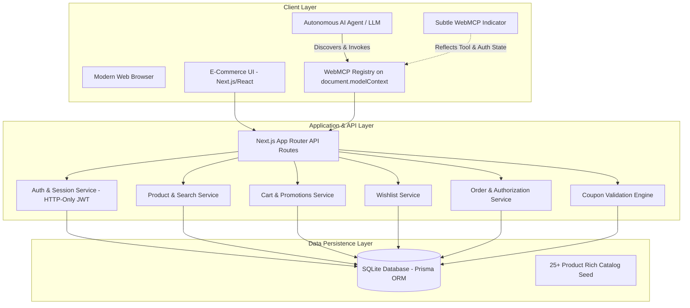

# AgentBridge: WebMCP-Powered E-Commerce Platform

A production-quality, full-stack e-commerce web application engineered for both human shoppers and autonomous AI agents through the **Web Model Context Protocol (WebMCP)**.

---

## 1. Architecture Overview

AgentBridge implements a unified e-commerce architecture where both the human-facing UI and autonomous AI agents operate against the same domain logic and database.



---

## 2. Key Features

### For Human Shoppers
- **Realistic Product Catalog**: 25+ rich hardware models across 9 categories (Laptops, Smartphones, Computer Accessories, Gaming, Headphones, Monitors, Cameras, Smart Devices, Audio).
- **Fuzzy Search & Autocomplete**: Real-time search with instant dropdown previews.
- **Multi-Filter & Sorting**: Filter by category, price range, customer ratings, brands, and in-stock status. Sort by popularity, price, rating, or discounts.
- **Product Detail Views**: Multi-angle image galleries, technical specifications tables, and verified buyer reviews.
- **Cart & Promo Engine**: Live cart management with promo code engine (`TECH20`, `SAVE10`, `WELCOME15`).
- **Safe Demo Checkout**: Complete checkout workflow with saved addresses, demo payment card, and instant order creation.
- **Customer Account Portal**: Order history tracking, live status indicators, order cancellation for eligible processing orders, and wishlist management.

### For Autonomous AI Agents (WebMCP)
- **Standardized WebMCP Discovery**: Exposes 18+ semantic tools on `document.modelContext`.
- **Dynamic Authentication State**: Public tools (`search_products`, `filter_products`, `get_product_details`) are available immediately. Authenticated tools (`add_to_cart`, `get_cart`, `get_order_history`, `cancel_order`) display as `LOGIN_REQUIRED` when unauthenticated and automatically switch to `AVAILABLE` upon login without page refresh.
- **Structured Error Responses**: Unauthenticated or unauthorized tool calls return machine-readable structured responses:
  ```json
  {
    "success": false,
    "error": "AUTHENTICATION_REQUIRED",
    "requiresAuthentication": true,
    "message": "Authentication is required to perform this action. Please log in to continue."
  }
  ```
- **Strict Authorization Boundary**: Tools accessing sensitive user data verify session ownership on the server (`order.userId === authenticatedUser.id`).
- **Minimal Unobtrusive Indicator**: Sleek floating pill `[↗ WebMCP]` in the bottom-right corner that expands on hover to display registered tools, permission status, schema definitions, and interactive tool tester.

---

## 3. WebMCP Tool Directory (18 Registered Tools)

| Tool Name | Category | Permission | Purpose & Inputs |
| :--- | :--- | :--- | :--- |
| `search_products` | Products | **PUBLIC** | Search catalog by keyword, product name, or brand (`query: string`, `limit?: number`) |
| `get_product_details` | Products | **PUBLIC** | Get full specs, pricing, stock, and reviews (`productId: string`) |
| `filter_products` | Products | **PUBLIC** | Filter by `category`, `brand`, `minPrice`, `maxPrice`, `minRating`, `inStockOnly` |
| `sort_products` | Products | **PUBLIC** | Sort by `price_asc`, `price_desc`, `rating`, `popularity`, `newest`, `discount` |
| `get_product_recommendations` | Products | **PUBLIC** | Smart recommendations by `productId`, `category`, or top-sellers |
| `compare_products` | Products | **PUBLIC** | Side-by-side spec comparison (`productIds: string[]`) |
| `check_product_stock` | Products | **PUBLIC** | Real-time stock status and inventory count (`productId: string`) |
| `get_current_promotions` | Promotions | **PUBLIC** | Retrieve active deals, featured products, and active coupons |
| `add_to_cart` | Cart | **AUTHENTICATED** | Add item to user cart (`productId: string`, `quantity: number`) |
| `get_cart` | Cart | **AUTHENTICATED** | Retrieve current user cart items, calculations, and discounts |
| `update_cart_quantity` | Cart | **AUTHENTICATED** | Update item quantity in cart (`productId: string`, `quantity: number`) |
| `remove_from_cart` | Cart | **AUTHENTICATED** | Remove product from cart (`productId: string`) |
| `apply_coupon` | Cart | **AUTHENTICATED** | Apply discount coupon code (`code: string`) |
| `add_to_wishlist` | Wishlist | **AUTHENTICATED** | Add product to wishlist (`productId: string`) |
| `remove_from_wishlist` | Wishlist | **AUTHENTICATED** | Remove product from wishlist (`productId: string`) |
| `get_wishlist` | Wishlist | **AUTHENTICATED** | Retrieve user saved wishlist items |
| `get_order_history` | Orders | **AUTHENTICATED** | Retrieve authenticated user previous orders |
| `get_order_details` | Orders | **AUTHENTICATED** | Get order details and tracking (`orderId: string`) |
| `cancel_order` | Orders | **AUTHENTICATED** | Cancel eligible order (`orderId: string`, `reason?: string`) |
| `create_order` | Orders | **TRANSACTIONAL** | Place order with shipping address and demo card from cart |

---

## 4. Evaluation Credentials & Quick Start

### Demo Customer Account
- **Email**: `demo@agentbridge.io`
- **Password**: `password123`
- *(Or click **"1-Click Demo Login"** inside the Sign In modal)*

### Available Coupons
- `TECH20` - 20% off all hardware
- `SAVE10` - 10% off storewide
- `WELCOME15` - 15% off first order

---

## 5. Local Development & Installation

### Prerequisites
- Node.js 18+ (tested on Node v20/v24)
- npm 9+

### Setup Steps
```bash
# 1. Install dependencies
npm install

# 2. Push SQLite schema & generate Prisma client
npm run db:push

# 3. Seed realistic catalog and demo user
npm run db:seed

# 4. Run automated test suite
npm run test

# 5. Start development server
npm run dev
```

Open [http://localhost:3000](http://localhost:3000) in your browser.

---

## 6. Testing Guide

Run the comprehensive Vitest test suite:
```bash
npm run test
```

The test suite validates:
1. Tool registration on `document.modelContext`.
2. Public tool executions and schema compliance.
3. Structured rejection of unauthenticated tool executions (`requiresAuthentication: true`).
4. Dynamic status updates upon login.
5. Authenticated tool executions for cart, wishlist, and orders.
6. Ownership authorization checks preventing cross-user data exposure.
7. Business rules preventing cancellation of shipped/delivered orders.
