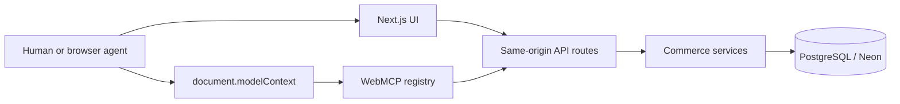

# AgentBridge

AgentBridge is a demo e-commerce application that exposes browser commerce operations as structured WebMCP tools while retaining a conventional shopper experience.

## 1. Project Overview

Next.js storefront, same-origin APIs, Prisma/PostgreSQL (Neon), and browser-native WebMCP share one server-authoritative commerce model.

## 2. Problem Statement

Visual inference is unreliable for authenticated commerce actions that need validated identifiers, ownership controls, and safe mutations.

## 3. Solution / Approach

Typed browser tools invoke the same APIs as the UI. APIs enforce authentication, validation, authorization, stock, coupon, and order rules.

## 4. What is WebMCP?

WebMCP is an emerging browser API that lets a page register structured tools for authorized agents in the active browser context. This is not a remote MCP server.

## 5. Why WebMCP?

Agents receive stable tool names, schemas, and errors rather than inferring actions from layout. Existing browser sessions and server safeguards remain in effect.

## 6. System Architecture

## 7. Agent ↔ Browser ↔ WebMCP Flow

1. The browser loads the app with WebMCP headers.
2. Public tools are exposed; protected tools follow authentication.
3. The agent discovers available tools and calls one with schema-valid input.
4. The tool uses the same API as the UI.
5. Cart responses update UI and state-aware availability.

## 8. WebMCP Tools

| Group | Tools |
| --- | --- |
| Public | `search_products`, `get_product_details`, `filter_products`, `sort_products`, `get_product_recommendations`, `compare_products`, `check_product_stock`, `get_current_promotions`, `get_available_product_variants`, `get_shipping_estimate` |
| Cart | `add_to_cart`, `get_cart`, `update_cart_quantity`, `remove_from_cart`, `clear_cart`, `apply_coupon` |
| Wishlist/account | `add_to_wishlist`, `remove_from_wishlist`, `get_wishlist`, `get_saved_addresses`, `update_shipping_address` |
| Orders | `get_order_history`, `get_order_details`, `cancel_order`, `create_order` |

There are 25 registered tools. See [tool contracts](docs/webmcp-tool-contracts.md).

## 9. Tool Discovery

Public tools are immediately available. Protected tools require login. Native registrations are aborted when unavailable; compatible browsers can emit `toolchange`.

## 10. Tool Schemas & Contracts

Schemas validate required fields, primitive types, and enums before execution. IDs must come from preceding catalog or account results; callers must not invent them.

## 11. Agent Interaction / User Journeys

Supported journeys include catalog search, product inspection, cart mutation, wishlist/address management, order inspection/cancellation, and demo checkout.

## 12. State-Aware Tool Exposure

`create_order` is unavailable with an empty cart. It appears only with cart contents and becomes unavailable after order creation or cart clearing. See the [state model](docs/webmcp-state-model.md).

## 13. Error Handling & Safety

Structured errors cover unknown tools, invalid input, authentication, unavailable state, and transport failures. APIs remain authoritative for ownership, stock, coupons, and orders.

## 14. Multi-Step Tool Execution

Evaluation chains use runtime placeholders such as `${resolvedProductId}`. A later call must use an ID returned by an earlier call.

## 15. Failure & Recovery Handling

Agents stop on non-retryable validation, authentication, ownership, and cart-state failures. Transport failures are retryable. Checkout requires `confirmDemoOrder: true`.

## 16. Testing Strategy

Deterministic tests cover tool boundaries, integration tests cover services, browser E2E covers visible state, and optional model evaluation records only measured results.

## 17. Deterministic Tests

`npm test` has 22 passing deterministic tests. It covers all 25 tools, request contracts, authentication, invalid input, state transitions, and checkout policy.

## 18. LLM / Probabilistic Evaluations

`npm run eval:webmcp:llm` uses the OpenAI Responses API when `OPENAI_API_KEY` is configured. It measures selection, arguments, chains, recovery, and latency without executing application tools.

## 19. Browser / E2E Evaluations

`npm run test:webmcp:e2e` resolves a live product from search results, opens details, adds it, verifies the cart, removes it, and verifies empty state. Measured result: **1/1 passed**.

## 20. WebMCP Inspector Validation

Chrome DevTools captures verify `Origin-Agent-Cluster: ?1` and `Permissions-Policy: tools=(self)`. The user verified tool execution in Model Context Tool Inspector. See [browser validation](docs/webmcp-browser-verification.md).

## 21. Evaluation Metrics

| Metric | Result |
| --- | --- |
| Deterministic tests | 22 passed |
| Dedicated integration run | 23 passed |
| Dataset schema | 10/10 passed |
| Browser E2E journey | 1/1 passed |
| LLM metrics | Not measured; provider key absent |

## 22. Results / Benchmarks

See the measured [final report](docs/webmcp-final-report.md). Results do not claim general model reliability because no provider-backed run is recorded.

## 23. Demo

Start the app, inspect headers, discover public tools, sign in, search, inspect a returned product, add it, inspect the cart, remove it, and optionally demonstrate the confirmation-gated `DEMO_CARD` flow.

## 24. Screenshots / Demo GIF / Video

Header and network captures are in [`docs/evidence/`](docs/evidence). No demo video is included.

## 25. Tech Stack

Next.js 14, React 18, TypeScript, Prisma 5, PostgreSQL/Neon, Vitest, Playwright, and Chrome WebMCP imperative API.

## 26. Project Structure

- `src/app/` pages and API routes
- `src/webmcp/` registry, tools, schemas, and trace harness
- `src/lib/` authentication, policy, and commerce services
- `src/context/` browser auth, cart, and wishlist state
- `tests/` deterministic, integration, and browser tests
- `evals/` generic tool-planning datasets
- `docs/` contracts, evidence, and reports

## 27. Setup & Installation

Prerequisites: Node.js 20+ and a PostgreSQL/Neon URL. Run `npm install`, create `.env` from `.env.example`, then run `npm run db:push` and `npm run db:seed`.

## 28. Environment Variables

| Variable | Purpose |
| --- | --- |
| `DATABASE_URL` | PostgreSQL/Neon application URL |
| `JWT_SECRET` | Session signing secret |
| `TEST_DATABASE_URL` | Preferred isolated integration database |
| `WEBMCP_TEST_DATABASE` | Required destructive-test acknowledgement |
| `WEBMCP_ALLOW_SHARED_DATABASE` | Explicit shared demo database permission |
| `OPENAI_API_KEY` | Optional LLM evaluation provider key |

Use [`.env.test.example`](.env.test.example) for test variables. Never commit secrets.

## 29. Running the Application

Run `npm run dev`, then open `http://localhost:3000`.

## 30. Running Tests

Run `npm test`, `npm run test:webmcp:integration`, and `npm run test:webmcp:e2e`. The integration command resets and seeds its selected database; read [testing guidance](docs/webmcp-testing-environment.md) first.

## 31. Running WebMCP Evaluations

Run `npm run eval:webmcp` for schema validation and `npm run eval:webmcp:llm` for optional provider evaluation.

## 32. Reproducibility

Use tracked migrations, seed data, and a dedicated test database. Browser E2E resolves runtime catalog data and generated evaluation outputs are ignored by Git.

## 33. Security Considerations

- HTTP-only signed sessions are verified by protected API routes.
- Server ownership checks protect orders and addresses.
- `tools=(self)` limits WebMCP tools to the same origin.
- Demo orders require a populated cart, confirmation, and `DEMO_CARD`.

## 34. Limitations

- WebMCP requires compatible Chrome configuration.
- Product variants are derived from stored specifications, not SKU-level inventory.
- LLM metrics await a configured provider and recorded run.
- This is a demo database and checkout flow, not production commerce.

## 35. Future Improvements

Persist SKU variants, provision ephemeral CI databases, compare provider/model runs, automate Inspector checks where supported, and add production payment controls only if scope expands.

## 36. Hackathon Requirements / How the Project Addresses Them

| Requirement | Implementation |
| --- | --- |
| Browser-native tools | Imperative `document.modelContext` registration |
| Typed discovery | Tool names, descriptions, and schemas |
| Real application state | Shared UI APIs and database |
| Safe mutations | Authentication, authorization, stock checks, demo checkout gating |
| Evaluation evidence | Deterministic, integration, E2E, Inspector, and optional LLM runner |

## 37. References

- [Chrome WebMCP Imperative API](https://developer.chrome.com/docs/ai/webmcp/imperative-api)
- [Chrome WebMCP security guidance](https://developer.chrome.google.cn/docs/ai/webmcp/secure-tools)
- [Prisma documentation](https://www.prisma.io/docs)
- [Next.js documentation](https://nextjs.org/docs)

## 38. License

Distributed under the [MIT License](LICENSE).

## 39. Contributors

- [misbah7172](https://github.com/misbah7172) — project owner and primary contributor.
